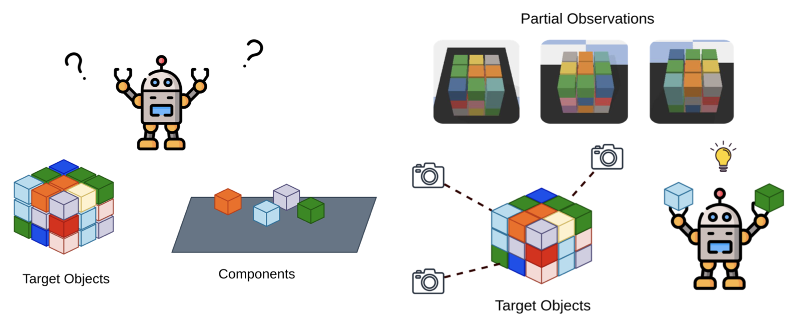
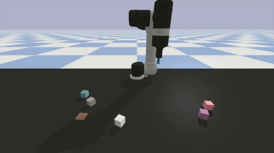
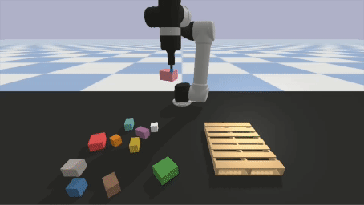

# LALA: Learning to Assemble via Learning to Attend

#### This is the course final project of CS598-YL Special Topics in Robot Learning. [[Project Report](assets/CS598_YL_Project_Report.pdf)] [[Project Slides](assets/Project_Presentation_LALA.pptx)]

<!--  -->





## TL;DR: Multi-view Target-driven Object Assembly by Robot Manipulation


## Abstract

In this project, we tackle on the problem of goal-oriented object assembly. More specifically, our objective is to train a robot to execute the object assembly task by predicting a sequence of pick and place positions based on the specified goal configurations for the target objects. Most goal-oriented object assembly methods require ground-truth states of every object in the workspace and train a graph-based policy. Al- though that information (e.g., positions and orientations) can be easily acquired from a simulator, it cannot be accurately captured in real-world scenarios, making graph-based policy infeasible. In this work, we utilize multi-view observations of the workspace as input and train a vision-based policy for goal-oriented object assembly. Our model LALA is built upon the Transporter Network, incorporating additional top-down orthographic feature maps and a forward branch for goal observation. Furthermore, we designed customized assembly tasks for this work, including the stacking of a single tower and the palletizing of boxes. The experiment results indicate that LALA performs worse than CLIPort in the stacking tower task and also achieve suboptimal performance in palletizing boxes.


## Environment Setup

```bash
git clone https://github.com/haoyuhsu/lala.git

conda create -n lala python=3.8
conda activate lala

pip install torch==1.7.1+cu110 torchvision==0.8.2+cu110 torchaudio==0.7.2 -f https://download.pytorch.org/whl/torch_stable.html
pip install pytorch_lightning==1.0.3

cd lala
pip install -r requirements.txt

# remember to run this on remote server
export CLIPORT_ROOT=$(pwd)
module load gcc/12.2.0

# run this everytime the code inside cliport/ is modified
python setup.py develop
```


## Dataset Collection

```bash
bash demos-stacking.sh     # 'n': number of demonstrations
```


## Model Training

```bash
bash train.sh
bash val.sh
```


## Quantitative Results

| Method                | Stacking Tower | Palletizing Boxes |
| :--------:            | :--------:     | :--------:        |
| CLIPort               | 27.0           | x                 |
| Single stream         | 13.4           | 6.0               |
| Two stream            | 15.8           | 6.3               |
| Two stream with lat.  | 0.0            | 0.0               |

Average rewards on 100 evaluation runs are reported.


## Acknowledgements

This work use code adapt from [CLIPort](https://github.com/cliport/cliport).


## Citations

**CLIPort**
```bibtex
@inproceedings{shridhar2021cliport,
  title     = {CLIPort: What and Where Pathways for Robotic Manipulation},
  author    = {Shridhar, Mohit and Manuelli, Lucas and Fox, Dieter},
  booktitle = {Proceedings of the 5th Conference on Robot Learning (CoRL)},
  year      = {2021},
}
```

**CLIP**
```bibtex
@article{radford2021learning,
  title={Learning transferable visual models from natural language supervision},
  author={Radford, Alec and Kim, Jong Wook and Hallacy, Chris and Ramesh, Aditya and Goh, Gabriel and Agarwal, Sandhini and Sastry, Girish and Askell, Amanda and Mishkin, Pamela and Clark, Jack and others},
  journal={arXiv preprint arXiv:2103.00020},
  year={2021}
}
```

**TransporterNets**
```bibtex
@inproceedings{zeng2020transporter,
  title={Transporter networks: Rearranging the visual world for robotic manipulation},
  author={Zeng, Andy and Florence, Pete and Tompson, Jonathan and Welker, Stefan and Chien, Jonathan and Attarian, Maria and Armstrong, Travis and Krasin, Ivan and Duong, Dan and Sindhwani, Vikas and others},
  booktitle={Proceedings of the 4th Conference on Robot Learning (CoRL)},
  year= {2020},
}
```